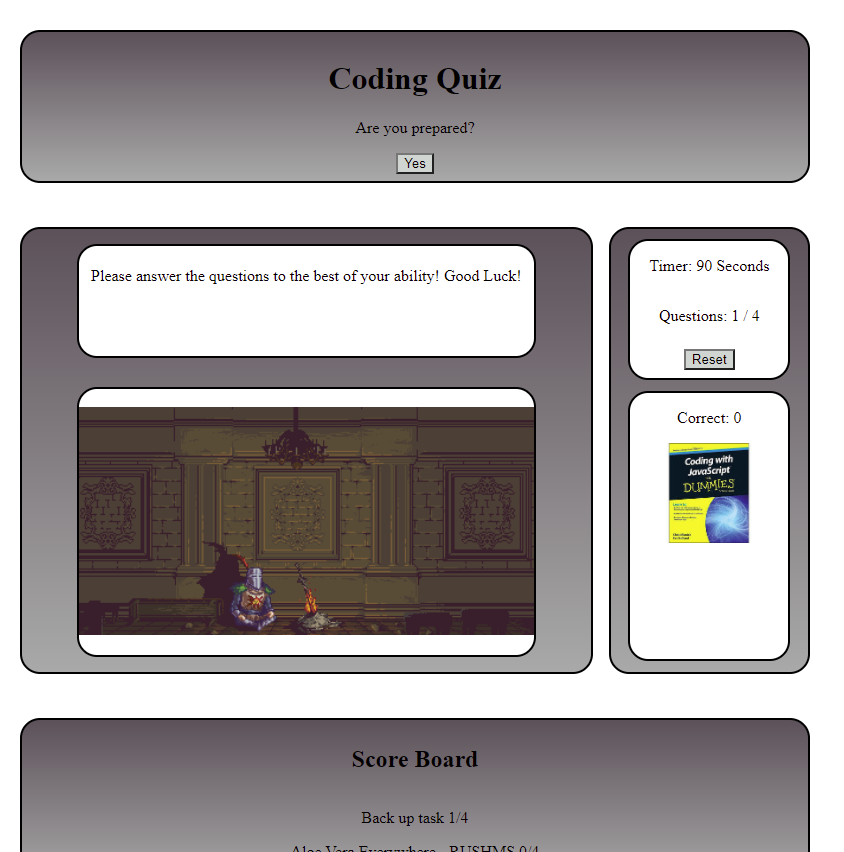

#Project Title; Coding Quiz for Dummies

Description of the App; 
As an introduction to world of coding we were tasked with the construction of a Coding quiz to prepare us for any job interviews in the future. The quiz gives you 90 seconds to complete 4 questions which is a huge amount of time. Each incorrect answer decreases the timer by 4 seconds as a punishment for not knowing the answer. If you complete the quiz in time then there is a section that allows the user to save their score for a later time in the local storage. There was moment where I thought I could construct my own questions so I created a quiz around the Crusades. That is now in the local branch for anyone to check out. 

Build Status; The code is all finished with the css all sorted with comments to help go through the page.

Screenshot; picture

Code Style; HTML, CSS & Javascript

Link to the website; 
https://nicholasdy.github.io/Coding-for-Dummies-Quiz-for-Columbia-Bootcamp/

Credit - Colombia University Coding Bootcamp
